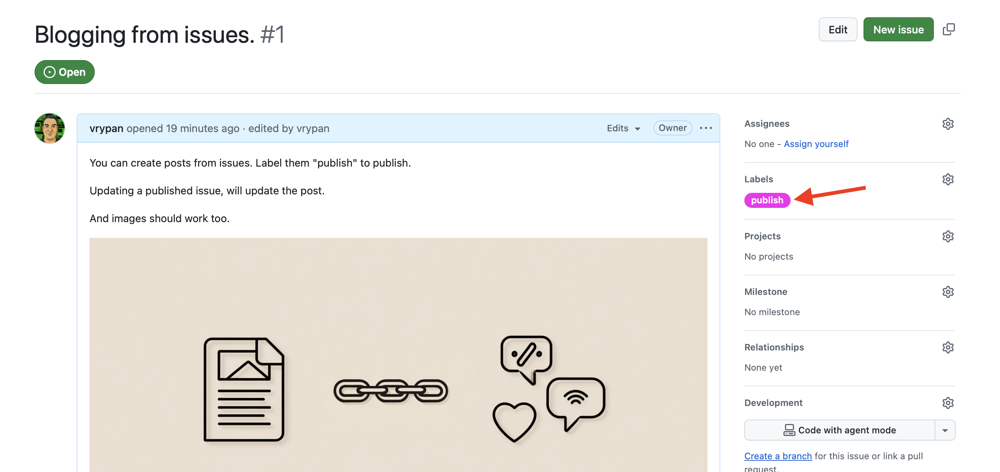

You can use GitHub issues to create new posts.

The workflow is inspired by [this post](https://shazow.net/posts/github-issues-as-a-hugo-frontend/).

The idea is simple:
- Creaate a new issue.
- label it "publish" (the label has to be "publish", create it if needed)
- The `issue-to-post.yml` will automatically convert it to a post, update
the blog and push it to GitHub Pages.

The frontmatter required will be created automatically, based on the issue title, and the
labels (used as tags).

If you want, you can add your own frontmatter to the issue, and the workflow will respect
any fields defined in it.

If you add images to the issue, the images will be downloaded locally, added to the post
directory and used from there.

